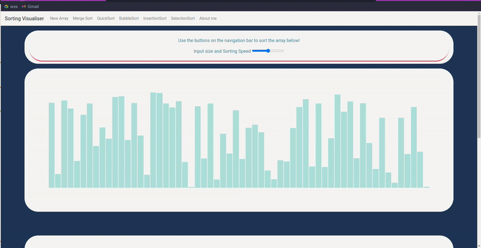

# 📊 Sorting Visualizer: A Dynamic Demonstration of Sorting Algorithms
Explore the beauty of sorting algorithms in action with this dynamic visualizer project. Watch as various sorting algorithms like Bubble Sort, Merge Sort, and Quick Sort come to life in a captivating visual representation. Gain insights into algorithmic efficiency and the mechanics behind sorting data. Immerse yourself in the world of algorithms with this interactive showcase.

## 💡 Algorithms

1. Merge Sort
2. Quick Sort
3. Bubble Sort
4. Selection Sort
5. Insertion Sort

## 🔥 Experience in Action [here](https://piyush-terkar.github.io/SortingVisualiser/)

